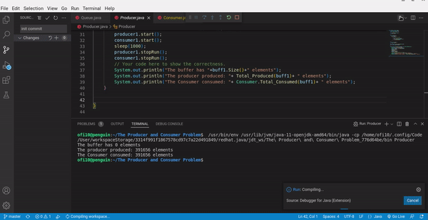

# *The-Producer-and-Consumer-Problem*
Submitted by: **Osaze Imohe**

## Overview

The Producer and Consumer problem is an illustration of one of the many uses of multithreading in Java. 

## The Code
This repository consists od three files. The producer, The Consumer and the Queue. The Producer produces an integer and add it to a buffer. The file Queue.java
is a circular Queue that acts as a buffer. As the producer adds integers to the buffer the consume simultaneously consumes those integers. The program returns 
the number of integers the producer produced, the number of integers the consumer consumed, and the number of integers currently in the buffer at the time of
both threads stopping

## Video Walkthrough

Here's a walkthrough of implemented user stories:

GIF created with [ezGIF](https://ezgif.com/).

## License

    Copyright [2022] [Osaze Imohe]

    Licensed under the Apache License, Version 2.0 (the "License");
    you may not use this file except in compliance with the License.
    You may obtain a copy of the License at

        http://www.apache.org/licenses/LICENSE-2.0

    Unless required by applicable law or agreed to in writing, software
    distributed under the License is distributed on an "AS IS" BASIS,
    WITHOUT WARRANTIES OR CONDITIONS OF ANY KIND, either express or implied.
    See the License for the specific language governing permissions and
    limitations under the License.
